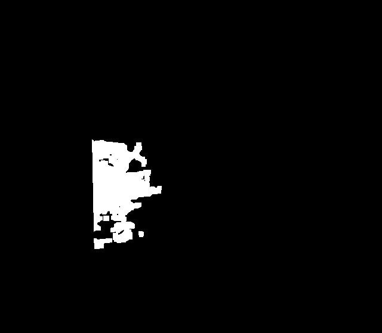
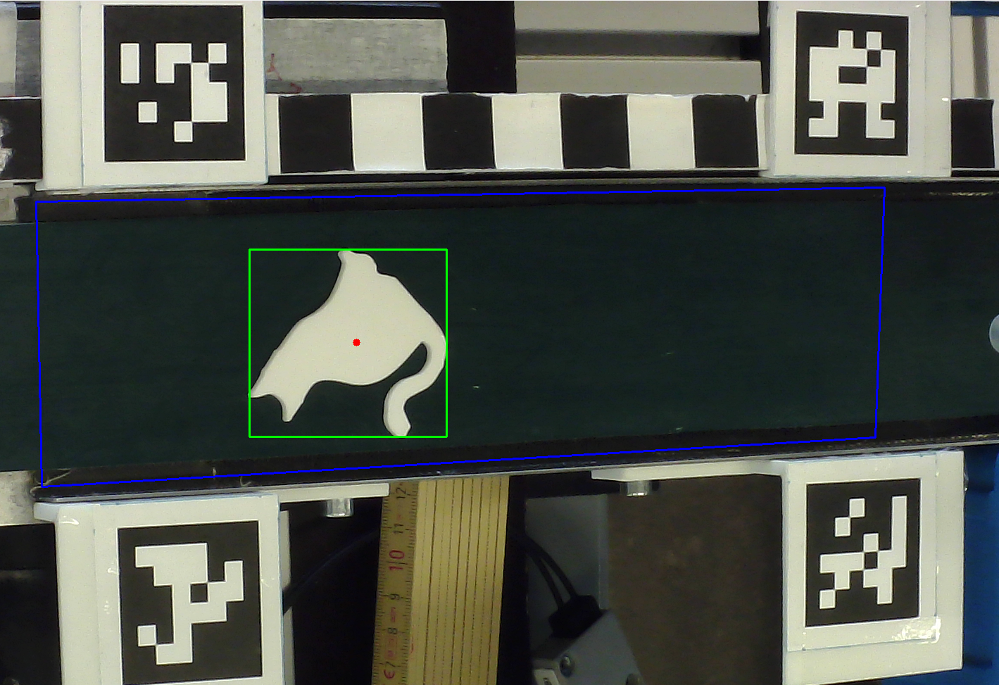
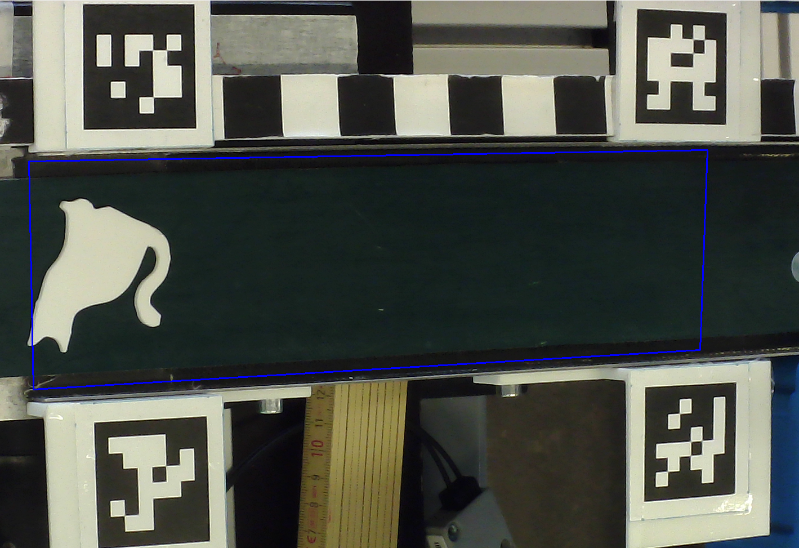

<!-- Geschrieben und dokumentiert von Yatheesh Sugumar -->

# Kamera-Pipeline Dokumentation
Dieses Dokument beschreibt den Ablauf und die Designentscheidungen der Kamera-Pipeline, von der Ausrichtung der Kamera bis zur Veröffentlichung der Objektdaten im ROS2-System. Die Reihenfolge der Kapitel folgt dem tatsächlichen Arbeitsablauf, wie er im Projekt umgesetzt wurde.

## Inhaltsverzeichnis

1. [Konzeptüberblick](#1-konzeptüberblick)
2. [ROI-Kontrolle](#2-roi-kontrolle)
3. [Kalibrierung](#3-kalibrierung)
4. [Bildvorverarbeitung und Objekterkennung](#4-bildvorverarbeitung-und-objekterkennung)
5. [Erstellung des Trainingsdatensatzes und Training](#5-erstellung-des-trainingsdatensatzes-und-training)
6. [Testen des Modells](#6-testen-des-modells)
7. [Klassifikation zur Laufzeit](#7-klassifikation-zur-laufzeit)
8. [ROS2-Knoten und Veröffentlichung](#8-ros2-knoten-und-veröffentlichung)

# 1. Konzeptüberblick
Aufgabe der Kamera-Pipeline ist es, Objekte auf dem Förderband zu erkennen, ihre Position in Weltkoordinaten zu bestimmen und sie einer von drei Klassen zuzuordnen: Katze, Einhorn oder Ausschuss. Diese Informationen werden über das ROS2-Topic `/CamData` an die Achssteuerung übergeben. Der gesamte Ablauf beruht durchgehend auf einfachen, klassischen Bildverarbeitungsmethoden statt auf komplexeren Verfahren wie Deep Learning, und wurde in mehreren aufeinander aufbauenden Schritten entwickelt: zunächst die korrekte Ausrichtung der Kamera sicherstellen, danach die Kalibrierung und Objekterkennung aufbauen, anschließend ein Klassifikationsmodell trainieren und testen, und zuletzt alles in einem ROS2-Knoten zusammenführen.

# 2. ROI-Kontrolle
Bevor mit der eigentlichen Entwicklung begonnen wurde, musste sichergestellt werden, dass die Kamera korrekt über dem Förderband ausgerichtet ist. Dazu wurde ein einfaches Kontrollskript verwendet, das den späteren Bildausschnitt (die Trapez-Maske) live über das Kamerabild zeichnet. So ließ sich direkt visuell prüfen, ob der markierte Bereich tatsächlich das gesamte Förderband abdeckt und nichts Wichtiges abgeschnitten wird. Dieser Schritt war notwendig, da sich die Trapez-Koordinaten auf die feste Position und den festen Blickwinkel der Kamera beziehen; bei einer Verschiebung der Kamera hätte der markierte Bereich entsprechend neu bestimmt werden müssen.

# 3. Kalibrierung
Um Objektpositionen später nicht nur in Pixeln, sondern in echten Weltkoordinaten angeben zu können, wurden vier ArUco-Marker fest im Arbeitsbereich montiert. Jedem Marker ist eine bekannte, feste Position in der realen Welt zugeordnet; der Ursprung des Koordinatensystems liegt dabei in der Mitte zwischen zwei der Marker, die X-Achse zeigt nach links, die Y-Achse nach oben.

Beim Start des Systems wartet das Programm, bis alle vier Marker im Kamerabild erkannt wurden. Aus den erkannten Pixelpositionen der Marker und ihren bekannten realen Positionen wird anschließend eine Homographie berechnet - eine Umrechnungsvorschrift, die jeden beliebigen Pixelpunkt im Bild in eine Weltkoordinate überführt. Diese Berechnung erfolgt nur einmal beim Start; da sich die Marker nicht bewegen, muss sie danach nicht mehr wiederholt werden.

Zur Kontrolle wurde nach der Berechnung geprüft, ob die vier Marker-Pixelpositionen, zurückgerechnet über die Homographie, wieder ihre bekannten Weltkoordinaten ergeben. Die berechneten Werte stimmten dabei bis auf wenige Zehntel Millimeter mit den erwarteten Werten überein, was die Kalibrierung bestätigt hat.

Eine Umsetzung über die in ROS2 vorgesehene Transformationsverwaltung (tf2) wurde bewusst nicht gewählt. Diese hätte zusätzliche Schritte erfordert, etwa das Anmelden eigener Koordinatensysteme im ROS2-System, einen dauerhaft mitlaufenden Hintergrundprozess zur Bereitstellung der Transformation sowie ein zeitbasiertes Warten auf Antworten bei jeder einzelnen Umrechnung. Für den vorliegenden, rein zweidimensionalen Fall war das nicht nötig; eine einmalig berechnete Umrechnungsvorschrift, die direkt auf jeden Punkt angewendet wird, war ausreichend.

# 4.Bildvorverarbeitung und Objekterkennung
Für jedes einzelne Kamerabild läuft zunächst eine feste Abfolge von Vorverarbeitungsschritten ab. Das Bild wird in Graustufen umgewandelt, da für die Objekterkennung keine Farbinformation benötigt wird, und leicht geglättet, um kleines Bildrauschen zu reduzieren. Anschließend wird mit dem Otsu-Verfahren automatisch ein Schwellwert bestimmt, um das Bild in Objekt (weiß) und Hintergrund (schwarz) aufzuteilen. Diese automatische Schwellwertbestimmung wurde einem festen, händisch gesetzten Wert vorgezogen, da Letzterer bei wechselndem Raumlicht unzuverlässig war. Danach wird das Bild morphologisch geöffnet, um kleine, durch Lichtreflexionen entstandene Störflecken zu entfernen, ohne die Form der eigentlichen Objekte zu verändern.

Besonders am Anfang des Förderbands, wo mehr Umgebungslicht einfällt, konnte es trotz Otsu-Schwellwert und morphologischem Opening noch zu Störungen im Binärbild kommen, wenn der Raum insgesamt zu hell beleuchtet war: einzelne Lichtreflexionen wurden dann selbst nach beiden Verarbeitungsschritten noch fälschlich als zusammenhängende weiße Fläche erkannt, wie im folgenden Bild zu sehen ist. Die Vorverarbeitung macht das System also robuster gegenüber wechselndem Licht, ersetzt aber nicht eine grundsätzlich angemessene Raumbeleuchtung.

Statt des gesamten Bildes wird nur der Bereich innerhalb der zuvor festgelegten Trapez-Form ausgewertet, da das Förderband durch die Kameraperspektive nicht rechteckig, sondern trapezförmig im Bild erscheint. Ein vollständiges Entzerren der Kameraperspektive wäre eine Alternative gewesen, wurde aber verworfen, da sie deutlich aufwendiger und dadurch auch fehleranfälliger gewesen wäre.

Innerhalb dieses Bereichs werden alle zusammenhängenden weißen Flächen als potenzielle Objekte erkannt. Damit können auch mehrere Objekte gleichzeitig auf dem Band erfasst werden, nicht nur das größte. Anhand von Fläche, Breite und Höhe werden unplausible Flächen (z. B. Bildrauschen) verworfen; ebenso werden Objekte verworfen, die den Rand des Trapez-Bereichs berühren, da diese nicht vollständig sichtbar sind und daher nicht zuverlässig vermessen werden können. Für jedes verbleibende Objekt wird der Schwerpunkt als Position bestimmt, statt der Mitte der Bounding Box, da der Schwerpunkt bei unregelmäßigen Objektformen die tatsächliche Verteilung der Objektmasse besser widerspiegelt und damit als Greifpunkt geeigneter ist. Diese Pixel-Position wird anschließend über die zuvor berechnete Homographie in eine Weltkoordinate umgerechnet. Am Ende werden alle gefundenen Objekte nach ihrer Position sortiert.

Die folgenden beiden Bilder zeigen diese Randbedingung im Vergleich:

# 5. Erstellung des Trainingsdatensatzes und Training
Um die Objekte später automatisch klassifizieren zu können, wurde ein Trainingsdatensatz aus eigenen Testbildern angelegt, aufgeteilt in vier Ordner: Katze, Einhorn, Kreis und Quadrat. Kreis und Quadrat wurden dabei beide als Ausschuss behandelt, da für die Sortierung nur zwischen Katze, Einhorn und Ausschuss unterschieden werden muss.

Für jedes Trainingsbild wird zunächst derselbe Trapez-Bereich wie im Live-Betrieb ausmaskiert, danach das Bild in Graustufen umgewandelt und mit einem festen Schwellwert in ein Binärbild überführt. Die äußere Kontur des Objekts wird bestimmt, und aus dieser Kontur werden die zwei Hu-Momente hu_0 und hu_3 berechnet. Ein Hu-Moment ist eine einzelne Kennzahl, die eine Formeigenschaft eines Objekts beschreibt, unabhängig davon, wie das Objekt gedreht, verschoben oder in der Größe leicht verändert im Bild liegt - das war wichtig, da die Teile in beliebiger Ausrichtung auf dem Band ankommen. hu_0 beschreibt dabei, wie kompakt bzw. rund eine Form ist, hu_3 beschreibt, wie unregelmäßig bzw. verzweigt sie ist. Diese zwei Merkmale reichten in Voruntersuchungen bereits aus, um alle vier Klassen sauber zu trennen; weitere Merkmale wurden getestet, brachten aber keine relevante Verbesserung und wurden daher nicht übernommen.

Mit diesen gesammelten Merkmalen und den zugehörigen Klassen wurde ein Decision Tree Classifier mit einer maximalen Tiefe von 5 trainiert. Diese Modellart wurde gewählt, weil sie eines der einfachsten Klassifikationsverfahren ist und für nur zwei Eingabemerkmale völlig ausreichte; ein aufwendigeres Modell wie eine SVM mit Kernel oder ein neuronales Netz hätte hier keinen nennenswerten Vorteil gebracht. Das fertig trainierte Modell wurde anschließend als Datei gespeichert, um es später im Live-Betrieb laden zu können, ohne es erneut trainieren zu müssen.

# 6. Testen des Modells
Um die Qualität des trainierten Modells zu überprüfen, wurde es auf einem separaten Satz von Testbildern ausgewertet, die nicht im Training verwendet wurden. Für jedes Testbild wurden dieselben Merkmale wie beim Training berechnet, die tatsächliche Klasse mit der vom Modell vorhergesagten Klasse verglichen und daraus eine Gesamtgenauigkeit sowie eine klassenweise Auswertung (u. a. wie viele Katzen korrekt als Katze erkannt wurden) erstellt. Dieser separate Testschritt war wichtig, um sicherzustellen, dass das Modell nicht nur die Trainingsbilder auswendig gelernt hat, sondern auch auf neuen, ihm unbekannten Bildern zuverlässig funktioniert.

# 7. Klassifikation zur Laufzeit
Im laufenden Betrieb wird das trainierte Modell einmalig beim Start des Kamera-Knotens geladen. Für jedes neue Kamerabild wird derselbe Trapez-Bereich ausmaskiert und über Graustufen, Otsu-Schwellwert und morphologisches Opening in ein Binärbild überführt, genau wie bei der Objekterkennung für die Position. Aus diesem Binärbild werden die äußeren Konturen bestimmt und nach denselben Kriterien wie bei der Positionsbestimmung gefiltert (Fläche, Breite, Höhe, Sichtbarkeit innerhalb des Bereichs), und ebenfalls von rechts nach links sortiert. Für jede verbleibende Kontur werden die Hu-Momente berechnet und dem geladenen Modell übergeben, welches daraus die Klasse des Objekts bestimmt: Ausschuss, Einhorn oder Katze.

# 8. ROS2-Knoten und Veröffentlichung
Der Kamera-Knoten führt die Positionsbestimmung und die Klassifikation für jedes Kamerabild zusammen. Beim Start des Knotens wird die Kamera geöffnet, einige Bilder werden verworfen, damit sich die Kamera einpendeln kann, und anschließend wird die Kalibrierung durchgeführt sowie das Klassifikationsmodell geladen. Danach läuft die Verarbeitung wiederkehrend im Takt eines Timers: Für jedes neue Bild werden die Objektpositionen und die zugehörigen Klassen jeweils bestimmt. Stimmt die Anzahl der erkannten Positionen nicht mit der Anzahl der erkannten Klassen überein, wird dies als Fehler protokolliert und das Bild übersprungen, statt fehlerhafte Daten zu veröffentlichen.

Stimmen beide Anzahlen überein, wird für jedes Objekt eine eigene Nachricht mit Objekttyp, x- und y-Weltkoordinate sowie einem Zeitstempel erstellt und auf dem Topic `/CamData` veröffentlicht. Diese Nachrichten werden anschließend von der Achssteuerung weiterverarbeitet.